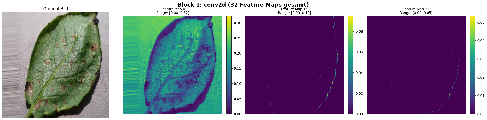
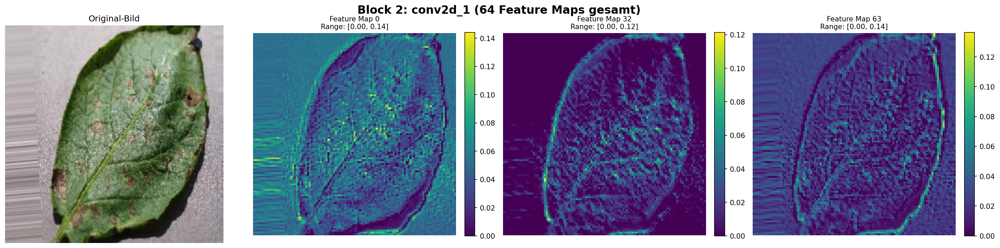

## Was soll in die Präsi


### Bilder werden verändert
````
train_datagen = ImageDataGenerator(
    rescale=1/255,
    rotation_range=20, 
    width_shift_range=0.2, 
    height_shift_range=0.2, 
    shear_range=0.2, 
    zoom_range=0.2,
    horizontal_flip=True,
    validation_split=0.2,
)
````
Damit das Neuronale Netzwerk nicht einfach die Bilder auswendig lernt, werden diese leicht geändert (rotiert, zoom usw.)

Vor allem auf ```validation_split=0.2,``` eingehen, da dort die Daten in 80% Trainingsdaten und 20% Validierungs- / Kontroldatendaten geteilt werden.

## Das CNN an sich

```` def create_small_cnn(num_classes):
    model = keras.Sequential([
        layers.Conv2D(32, (3, 3), activation='relu', input_shape=(IMG_SIZE, IMG_SIZE, 3)),
        layers.MaxPooling2D((2, 2)),
        
        layers.Conv2D(64, (3, 3), activation='relu'),
        layers.MaxPooling2D((2, 2)),
        
        layers.Flatten(),
        layers.Dense(128, activation='relu'),
        layers.Dropout(0.5),
        layers.Dense(num_classes, activation='softmax')
    ])
    return model
````

Hier ist wichtig zu beachten, dass der gesamte Codeblock an sich das CNN ist. Es findet keine Trennung zwischen *erst* CNN und *dann* "Normales Neuronales Netzwerk" statt. 

Ein CNN verwendet **Filter** die über das Bild gleiten, lokale Muster erkennt, die **räumliche Struktur** beibehält, und **hierarchisch lernt**.


**Räumliche Struktur** heißt hier, das die umliegenden Pixel ebenfalls bei der Verarbeitung des aktuellen Pixels beachtet werden. Deswegen wird auch ein 3X3 Filter verwendet.

**Hierarchisches Lernen** bedeutet, dass die Filter des ersten Blocks nur einfache Muster wie Kanten lernt, während die Filter späterer Blöcke komplexere Muster wie rote Flecken erkennt.



*Feature Maps des ersten Filterblocks*



*Feature Maps des zweiten Filterblocks*

## Callbacks

```callbacks = [
    keras.callbacks.EarlyStopping(
        monitor="val_loss", 
        patience=5,
        restore_best_weights=True
    ),
    keras.callbacks.ReduceLROnPlateau(
        monitor="val_loss", 
        factor=0.5,
        patience=3,
        min_lr=1e-7
    )]
```
Callbacks stellen sicher, dass das Training abgebrochen wird, wenn auch nach längerer Zeit keine Verbesserung der Parameter *(in diesem Fall **val_loss**)* eintritt. 

Dadruch wird sichergestellt, dass das Modell nicht unnötig lang trainiert, und Overfitting (Das Modell *merkt* sich Bilder, statt diese tiefgründig zu analysieren) vermieden wird.